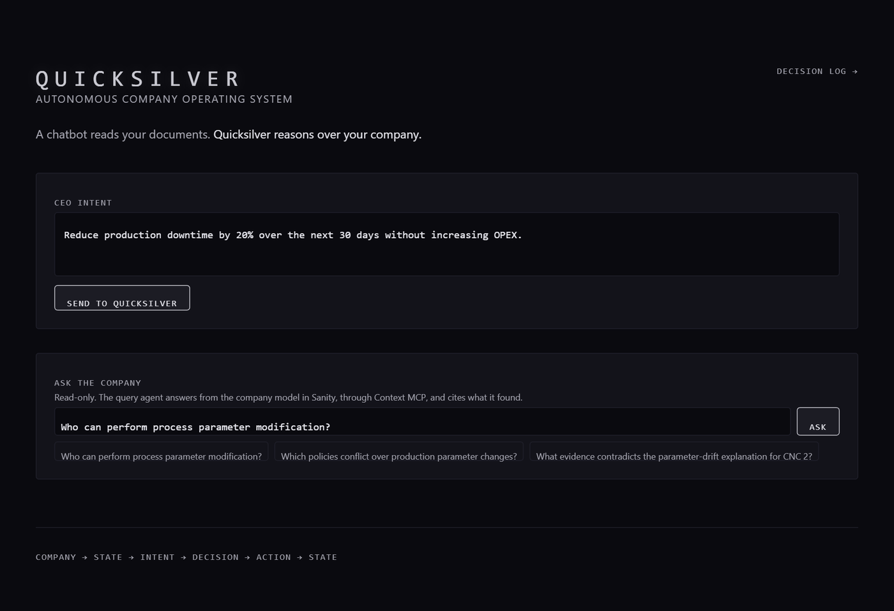
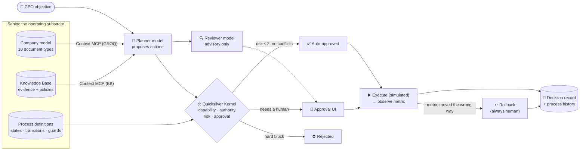
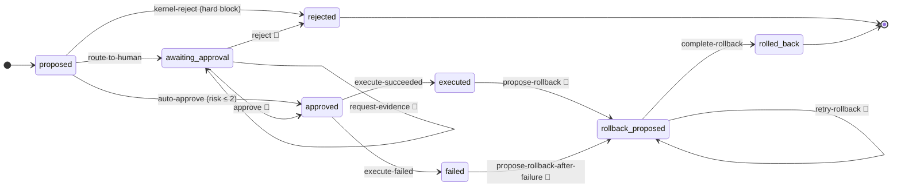

<div align="center">

# ⚡ Quicksilver

### An Autonomous Company Operating System

**A chatbot reads your documents. Quicksilver reasons over your company.**

[](https://quicksilver-seven.vercel.app)
[](https://dev.to/challenges)


[**Try it live**](https://quicksilver-seven.vercel.app) ·
[**Decision log**](https://quicksilver-seven.vercel.app/decisions) ·
[**Studio**](https://qkslvr.sanity.studio) ·
[**Path One post**](./docs/DEV-POST-PATH-ONE.md) ·
[**Path Two post**](./docs/DEV-POST-PATH-TWO.md) ·
[**Build log**](./BUILD-LOG.md)

</div>

<p align="center">
  <a href="https://quicksilver-seven.vercel.app"></a>
</p>

---

Give Quicksilver an objective like *"Reduce production downtime by 20% without increasing OPEX."* An LLM agent reads a **structured model of the company** stored in Sanity (people, agents, capabilities, policies, evidence) and proposes a plan. Then a **deterministic kernel with no LLM inside it** decides what may happen. Each proposed action is auto-approved, sent to a human, or hard-blocked. Every step is recorded as an auditable decision in Sanity.

> **The LLM proposes. The kernel authorizes. The company's playbook is content, and the kernel runs it.**

## How it works



## Why it isn't "just RAG"

A keyword search finds *"Engineering approval is required for parameter changes."* Quicksilver works out things a search can't, and it's clear about which part does what: the **kernel** is deterministic code, the **agent** is the LLM reading Sanity.

| Question | Worked out by |
|---|---|
| Does this actor actually **hold the capability**, and is it granted? | Kernel, from `entity` → `capability` references |
| Which policies **apply**, which are **superseded**, which **conflict**? | Kernel: policy scope + `supersedes[]`; two live policies in the same scope are flagged as a conflict |
| Does any evidence **contradict** the plan, and how confidently? | Agent, from `evidence.contradicts[]` + confidence (GROQ) and the Knowledge Base's own contradiction detection |
| How **risky** is it: base risk, impact, reversibility, uncertainty? | Kernel, a deterministic formula, 0–5 |
| Who has to approve, and **what can happen next**? | Kernel, running the Decision Lifecycle process stored in Sanity |

The seed data includes a real dilemma. Operations Policy 17 and Emergency Policy 4 conflict in the same scope, and a historical incident (confidence 0.92) says the root cause is mechanical, not parameter drift. The agent has to reason through a conflict that is actually in the data, not one staged for the demo.

## The playbook is content

Every decision moves through the **Decision Lifecycle**, a process definition stored as a Sanity document and run by the kernel. It has 8 states and 12 transitions. Its guards are structured data (`{ fact, op, value }`), never code strings.



- **Tighten the autonomy ceiling in Studio** by changing one number, and the next decision follows it, with no redeploy.
- **Illegal jumps are refused** with a plain-English reason. Approve, reject and rollback always need a human click; the kernel and executor can never take them. (The demo has no login, so anyone using the app is that human.)
- **Every step is stamped** with the definition's version and `_rev`, so you can see exactly which rules were in force.
- **A broken definition stops the line.** If a state is unreachable or a guard is malformed, the kernel moves nothing rather than bypassing its own playbook.
- **Optimistic locking**: two simultaneous approvals give exactly one success and one clean `409`.

## Try it in 60 seconds

1. Open **[quicksilver-seven.vercel.app](https://quicksilver-seven.vercel.app)**. There's no login, and the objective is pre-filled.
2. Try **Ask the company** first: a read-only question like *"Who can perform process parameter modification?"* The query agent answers from Sanity through Context MCP, with its sources, in 20–40 seconds.
3. Click **Send to Quicksilver**. A real plan takes about a minute.
4. Scroll to **Decisions**. Each card shows the kernel's risk and verdict and a **Process** line (where it is, what can happen next). Click **Show reasoning & evidence** for the policies, evidence and the dashed **Independent review** from the reviewer model.
5. **Approve** a card, **Execute** it (simulated) and **Observe** the metric. If it moves the wrong way, **propose a rollback**.
6. Open the **[Decision log](https://quicksilver-seven.vercel.app/decisions)** to see every transition, who took it (kernel, human or executor) and when.

## Proven live, not just in tests

| Check | Result |
|---|---|
| Kernel unit tests: authorization, risk calibration, process engine | **39 / 39** |
| Agent tests: model config, strict-schema guards for every model schema | **13 / 13** |
| Live governance stress test on production: lanes, races, prompt injection, a broken definition | **17 / 17** |
| Automated live e2e (`npm run e2e:live`): Resume after a broken definition, Retry after a failed rollback | **44 / 44** |

The two live runs were made against Decision Lifecycle v2; v3 changed only which guard catches decisions routed to a human.

The stress test found real bugs: a risk formula that scored nearly everything 5/5, a failed rollback that could strand a decision, and a strict-schema error on the query route. Each one is fixed and written up in the [build log](./BUILD-LOG.md).

## Stack

| Layer | Choice |
|---|---|
| App | Next.js 15 (App Router), TypeScript, Tailwind, deployed on Vercel |
| Content & state | Sanity Studio + Content Lake: 10 document types, 53 seed documents |
| Agent read path | Sanity **Context MCP**, in both GROQ mode (live dataset) and Knowledge Base mode (cited, with contradiction detection) |
| Agent harness | AI SDK 6 + `@ai-sdk/mcp`, role-based models (planner + independent reviewer; Azure OpenAI in production) |
| Authority | **Quicksilver Kernel**: deterministic TypeScript with no LLM, fail-closed |
| Write path | `@sanity/client` mutations with `ifRevisionId` optimistic locking |
| Studio extras | `sanity-plugin-workflow` board for editorial review of decisions |

## Repository layout

```
quicksilver/
├── apps/
│   ├── web/            Next.js app: CEO console, Decision log, API routes
│   │   └── app/api/    plan · query · decisions/[id]/{action,execute,observe,rollback,resume}
│   └── studio/         Sanity Studio: schemas, seed data, scripts (seed, smoke, e2e, reset)
├── packages/
│   ├── kernel/         Deterministic authority + process engine (no LLM)
│   └── agent/          Planner, reviewer, query agent, MCP bindings, model roles
├── docs/               DEV posts, demo script, early drafts
├── ARCHITECTURE.md     Design and data model
├── SUBMISSION.md       Challenge details, Sanity project info, how to run
└── BUILD-LOG.md        Day-by-day build history across every environment
```

## Run it locally

```bash
git clone https://github.com/nuerainc/quicksilver-sanity-challenge.git
cd quicksilver-sanity-challenge
npm install
cp .env.example .env        # then fill in Sanity + model credentials

npm run schema:deploy       # deploy the Studio schema (Context MCP needs it)
npm run seed                # push the 53-document demo company
npm run dev:studio          # Studio  → http://localhost:3333
npm run dev:web             # App     → http://localhost:3000
```

```bash
npm run kernel:test         # 39 kernel tests
npm run agent:test          # 13 agent tests
npm run smoke               # dataset integrity
npm run verify:mcp          # both Context MCP endpoints, live
npm run verify:llm          # each model role responds; planner + reviewer also do tools + structured output
```

Set `QUICKSILVER_PROCESS_ENGINE=on` to have the kernel run the Decision Lifecycle stored in Sanity. See [`.env.example`](./.env.example) for every variable and [`SUBMISSION.md`](./SUBMISSION.md) for the full setup, including Azure.

## Sanity project

| | |
|---|---|
| Project ID | `d280bqjc` |
| Dataset | `production`, **public** (query it: `https://d280bqjc.apicdn.sanity.io/data/query/production?query=*`) |
| Studio | https://qkslvr.sanity.studio (needs a Sanity login with project access) |
| Organization | `ou5ydq271` |

## How it was built

Quicksilver was built for the **[Sanity Challenge](https://dev.to/challenges)** (Sept 18 – Oct 4, 2026) and entered in both paths from one codebase:

- **Path One**, *Ship an Agent That Queries Real Content*: [Quicksilver: An Autonomous Company Operating System](./docs/DEV-POST-PATH-ONE.md)
- **Path Two**, *Vibe-Code Something Strange*: [Quicksilver: The Company That Operates Itself](./docs/DEV-POST-PATH-TWO.md)

**MiniMax Agent** built the architecture through hardening. **Claude Code** (via Cowork) added the Knowledge Base integration, the live reviewer, the deployment, the process engine and the live testing. The manual work was done in **VS Code**. All of it is in one unified [build log](./BUILD-LOG.md), including every real error and how it was fixed.

## License

[MIT](./LICENSE) © 2026 J.B.T. Beebe
